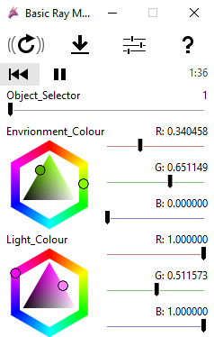

# Extended (and Combined) Primitives (Shadron/GLSL)
A [Shadron](http://www.arteryengine.com/shadron/) shader (based on GLSL) that displays different primitive shapes using ray marching with the addition of modifiers. The shapes are lit by a singular point light. The environment and light colours can be controller using the Shadron GUI. The modifiers extend the shapes. Some shapes are also a combination of primitives.

### Shadron Colour Control

